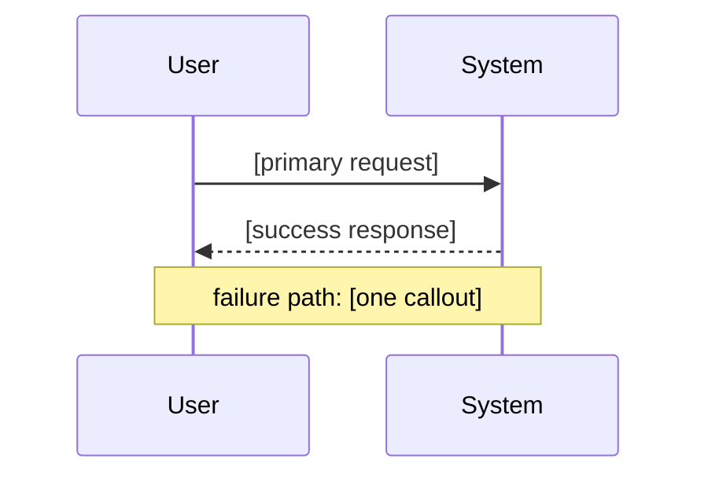

# Plan: [feature name]

<!--
Hard rail: 2–3 pages max (~1,500 words or ~120 lines, excluding this comment block).
Target ~2 pages (~1,000 words / ~80 lines). Use tables and bullets, not prose.
Defer screen detail → design.md; contracts/schemas → architecture.md.
Delete this comment block before handoff.
-->

## Run metadata

| Field | Value |
|-------|-------|
| Plan format | **full** |
| Branch | `feat/...` |
| Workflow profile | `web-product` |
| Route after plan | `design` / `architect` / `build` |
| Stack | **From codebase:** … / **Recommended:** … |

## Layer 1 — Problem & requirements

**Problem:** [One paragraph: who, what is wrong/missing, why now]

**Goals:** [1–3 measurable outcomes]

**Non-goals:** [Bullets — explicit out of scope]

| ID | Requirement | Type |
|----|-------------|------|
| FR-1 | … | functional |
| NFR-1 | … | non-functional |

**Assumptions:** [Bullets; unverified → open question]

**Open questions:** [Blockers only, or "None"]

**Success criteria:** [How we know it is done]

---

## Layer 2 — Functional specification

**Primary flow:** [Numbered steps, external view only]

**Alternate flows:** [Bullets or short table]

| Req | Behavior that satisfies it |
|-----|----------------------------|
| FR-1 | … |

| Edge / failure | Expected external behavior | In scope? |
|----------------|----------------------------|-----------|
| Empty input | … | yes / no / defer |
| Timeout / 5xx | … | … |
| Permission denied | … | … |

**Failure callouts**

| What breaks | User/system sees | Blast radius | Mitigate in scope? |
|-------------|------------------|----------------|--------------------|
| … | … | … | yes / no / accept |

---

## Layer 3 — Technical specification

| Component | Responsibility |
|-----------|----------------|
| … | … |

**Data model (direction):** [Entities + relationships, no full DDL]

**Integrations:** [3P APIs; mock via env: `MOCK_*=true`]

**Security:** [Authz, secrets, PII — bullets]

**Design system** (UI profiles only): [Pick one + one-line rationale; default Shadcn + Tailwind]

**Ops touch** (if devops profile): [Infra / env / CDN changes, or "None"]

---

## How to run (terminal / CLI)

| Step | Framework / tooling | Barebone / fallback |
|------|---------------------|---------------------|
| Install deps | `…` | — |
| Start (dev) | `…` | `…` |
| Run feature | `…` | `…` |
| UI / access | `http://…` or `npm run …` | URL + port |
| Smoke verify | `…` | `curl …` → expected |

**Example invocation:** [one copy-paste command + expected output or URL]

**Env vars (if any):** `VAR=value …`

---

## Planned test cases

| ID | Req | Scenario | Expected | Type |
|----|-----|----------|----------|------|
| T-1 | FR-1 | Happy path | … | e2e |
| T-2 | FR-1 | [edge from layer 2] | … | integration |
| T-3 | NFR-1 | … | … | unit / integration |
